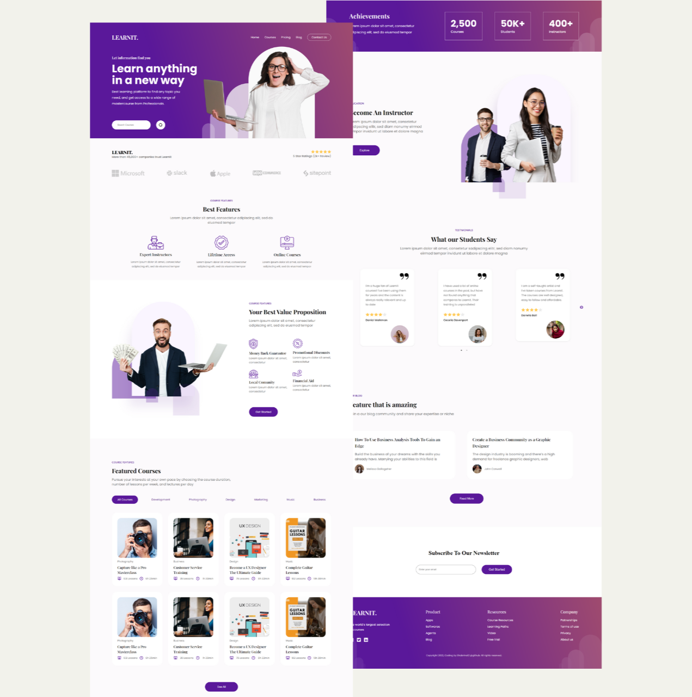

# Responsive Front End Website - LearnIt Course Landing Page using React JS

Library used:
1. react icons
2. react slick

Figma Web Design & elements from https://ui8.net/ Published by Dmm Kreativ 
(link: https://ui8.net/dmm-kreativ/products/uniquepages?status=7)

Deployed Web: https://visionary-queijadas-b6b2ca.netlify.app/

