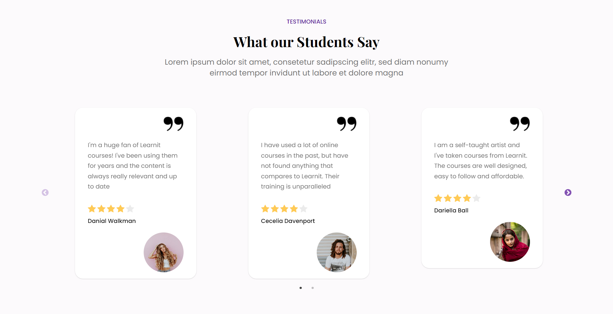

# Responsive Front End Website - LearnIt Course using React JS
This project is a single page web front end for Learn It using the React JS framework. I created this project as an exercise to develop front end skills

## Table of contents

- [Overview](#overview)
  - [The challenge](#the-challenge)
  - [Screenshot](#screenshot)
  - [Links](#links)
- [My process](#my-process)
  - [Built with](#built-with)
  - [What I learned](#what-i-learned)
  - [Continued development](#continued-development)
  - [Useful resources](#useful-resources)
- [Author](#author)
- [Acknowledgments](#acknowledgments)


## Overview

### The challenge

- Build out the project to the designs provided
- Adding slider for the testimonial section

### Screenshot


### Links
- [Live Site URL](https://visionary-queijadas-b6b2ca.netlify.app/)

## My process

### Built with

- Semantic HTML5 markup
- CSS custom properties
- Flexbox
- CSS Grid
- [React JS](https://reactjs.org/) - JS library
- [react icons](https://react-icons.github.io/react-icons/) - JS library to add icons
- [react slick](https://react-slick.neostack.com/) - React Slick is library for creating carousels. It offers accessibility and responsiveness, amongst other features to help create performant carousels


### What I learned

I learned a simple way to add slider function in testimonial section using swiper js library

Code snippets, see below:
```js
<Swiper className='swiper'
            breakpoints={{
                // width >= 300
                300: {
                    slidesPerView: 1,
                    spaceBetween: 70
                },
                // width >= 600
                600: {
                    slidesPerView: 1,
                    spaceBetween: 100
                },
                // width >= 1000
                1000: {
                    slidesPerView: 2,
                    spaceBetween: 130
                }
            }}
            modules={[Navigation, Pagination, A11y]}
            spaceBetween={120}
            slidesPerView={2}
            navigation
            pagination={{ clickable: true }}
            onSlideChange={() => console.log('slide change')}
            onSwiper={(swiper) => console.log(swiper)}
        >
```



If you want more help with writing markdown, we'd recommend checking out [The Markdown Guide](https://www.markdownguide.org/) to learn more.


### Continued development
The development of this project can be continued by adding functionality to the cart, and implementing infinite scrolling in the product section

### Useful resources
- [Figma Web Design & elements i used for this project is published by Dmm Kreativ](https://ui8.net/dmm-kreativ/products/uniquepages?status=7)
- [UI/UX Design Resources](https://ui8.net/) - This website provide many UI/UX design some are free. I really liked this website and will use it going forward.
- [Article about creating carousel using react slick](https://blog.logrocket.com/create-carousel-react-slick/) - This is an article which helped me understand react slick.


## Author

- Github - [Shabrina Putri](https://github.com/shabrina12/)
- Instagram - [@shabputri_](https://www.twitter.com/yourusername)


## Acknowledgments

This is where you can give a hat tip to anyone who helped you out on this project. Perhaps you worked in a team or got some inspiration from someone else's solution. This is the perfect place to give them some credit.

