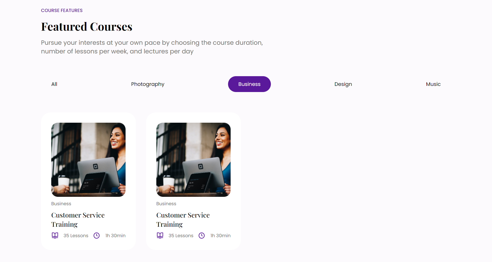

# Responsive Front End Website - LearnIt Course using React JS
This project is a single page front end web for Learn It built with React JS framework. I created this project as an exercise to develop front end skills

## Table of contents

- [Overview](#overview)
  - [The challenge](#the-challenge)
  - [Screenshot](#screenshot)
  - [Links](#links)
  - [Credit](#credit)
- [My process](#my-process)
  - [Built with](#built-with)
  - [What I learned](#what-i-learned)
  - [Continued development](#continued-development)
  - [Useful resources](#useful-resources)
- [Author](#author)

## Overview

### The challenge

- Build out the project to the designs provided
- Adding slider for the testimonial section
- Implemented category filtering to filter courses by category using react hooks (section 3)

### Screenshot


### Links
- [Live Site URL](https://learn-it-front-end-webpage.vercel.app/)

### Credit 
- [Figma Web Design & UI Kit i used for this project is published by Dmm Kreativ](https://ui8.net/dmm-kreativ/products/uniquepages?status=7)


## My process

### Built with

- Semantic HTML5 markup
- CSS custom properties
- Flexbox
- CSS Grid
- [React JS](https://reactjs.org/) - JS library
- [react icons](https://react-icons.github.io/react-icons/) - JS library to add icons
- [react slick](https://react-slick.neostack.com/) - React Slick is library for creating carousels. It offers accessibility and responsiveness, amongst other features to help create performant carousels


### What I learned
I learned how to implement a filter function using react hooks to filter courses based on each category

Code snippets, see below:
```js
const allCategories = ['All', ...new Set(Data.map(course => course.category))];

const [courseMenu, setCourseMenu] = useState(Data);
const [buttons, setButtons] = useState(allCategories);
  
//filter category function
const filter = (button) =>{
  if(button === 'All'){
    setCourseMenu(Data);
      return;
  }
  const filteredData = Data.filter(course => course.category ===  button);
  setCourseMenu(filteredData)
}
```
The following screenshot is an example of displaying a list of courses based on business category


I also learned a simple way to add slider function in testimonial section using react slick library
Code snippets, see below:
```js
const settings = {
        dots: true,
        infinite: false,
        speed: 500,
        slidesToShow: 3,
        slidesToScroll: 3,
        initialSlide: 0,
        responsive: [
          {
            breakpoint: 1210,
            settings: {
              slidesToShow: 3,
              slidesToScroll: 3,
              infinite: true,
              dots: true
            }
          },
          {
            breakpoint: 1200,
            settings: {
              slidesToShow: 2,
              slidesToScroll: 2,
              initialSlide: 2
            }
          },
          {
            breakpoint: 600,
            settings: {
              slidesToShow: 1,
              slidesToScroll: 1
            }
          }
        ]
    };
```


### Continued development
The development of this project can be continued by creating multiple page for each links in navigation bar, and implementing infinite scrolling in the courses section (section 3)

### Useful resources
- [UI/UX Design Resources](https://ui8.net/) - This website provide many UI/UX design some are free. I really liked this website and will use it going forward.
- [Article about creating carousel using react slick](https://blog.logrocket.com/create-carousel-react-slick/) - This is an article which helped me understand react slick.
- [Youtube video on category filtering in React JS](https://www.youtube.com/watch?v=cbEHLalLLeM)
- [Article about category filtering in React JS](https://contactmentor.com/filter-list-by-category-react-js/)

## Author
Github - [Shabrina Putri](https://github.com/shabrina12)

